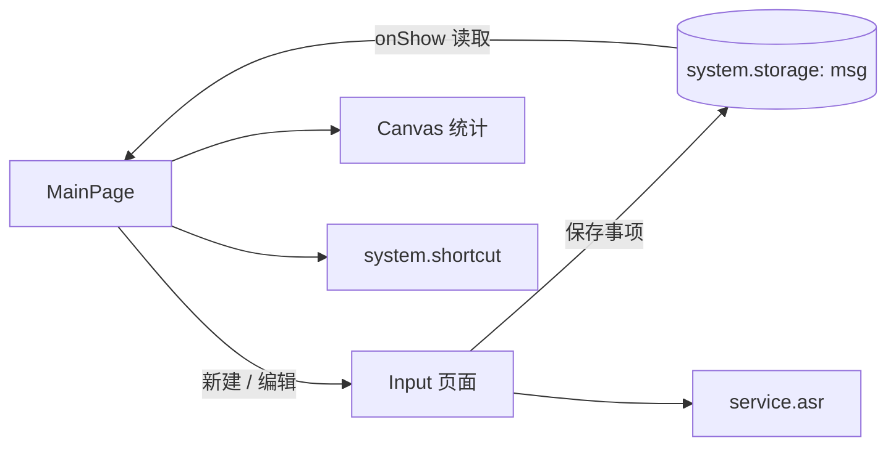

# HIT-Quick-App-TODO

这是一个基于小米快应用平台做的 TODO 备忘录。它不是把网页缩小到手机上，而是用 `.ux` 单文件组件把页面模板、样式和交互逻辑放在一起，再通过快应用提供的 storage、router、prompt、shortcut、vibrator 和语音识别能力，把“写下一件事”这件小事做成一条完整的移动端流程。

项目来自一次企业短期实训。报告里记录的不只是功能清单，还包括当时第一次接触 HTML/CSS/JavaScript、Node.js/npm 和快应用组件模型的过程。代码也保留了那个阶段很明显的取舍：功能闭环优先，数据先放在本地，界面用 Canvas 做简单统计，先把一个可操作的应用做出来。

## 先看它能做什么

- 新建、编辑和删除事项。
- 根据开始时间把事项放进 `TODO` 或 `DOING`。
- 点击完成后移动到 `DONE`。
- 支持设置截止时间，也支持 `NO DDL`（无截止时间）。
- 使用 `@system.storage` 保存三类列表，退出页面后仍能恢复。
- 在统计页画两张 Canvas 图：三种状态的数量曲线，以及按超时/一天内/一周内/一月内/更远划分的截止时间环图。
- 调用 `@service.asr` 做语音输入，并用短震动和 Toast 做操作反馈。
- 从菜单创建桌面快捷方式。

## 页面和数据流



事项没有单独的数据库表，而是以一个 JSON 对象保存：

```json
{
  "toDoList": [],
  "doingList": [],
  "doneList": []
}
```

单条事项包含 `name`、`start` 和 `end` 三个字段。`start`/`end` 使用类似 `2020-7-27&1:23` 的字符串表示；无截止日期用 `wow! no ddl!` 表示。现在看这个格式不如 ISO 8601 规整，但它很直观，也能看出项目当时是如何在有限的快应用 API 里快速完成功能的。

## 关键实现

### 状态转换不是写死在页面上的

`MainPage/index.ux` 在 `onShow()` 中读取本地列表，然后把已经到开始时间的事项从 `toDoList` 移到 `doingList`。完成事件根据来源列表把事项放到 `doneList`，删除只针对已完成列表。这样页面重新显示时，数据仍会回到对应状态。

### 统计图直接从事项数据计算

`drawLineCanvas()` 取三类列表长度，计算三个点的位置，再用三段贝塞尔曲线连起来；`drawTimeCanvas()` 遍历 TODO/DOING，把截止时间分成五个区间，计算百分比和圆弧角度。它没有引入图表库，代码量不大，但从数据到视觉反馈的路径很完整。

### 输入页把平台能力接了进来

`Input/index.ux` 负责名称、日期、时间和无截止日期开关。按下语音按钮后，`service.asr` 返回的文本会追加到当前任务名；保存时再判断开始时间，决定事项进入 TODO 还是 DOING。这是我比较喜欢的一段设计：页面输入、时间判断和本地存储都在一次保存动作里串起来了。

## 实际演示

课程演示视频保留在 [`docs/demo.mp4`](docs/demo.mp4)。它比一张静态截图更能说明页面切换、事项状态移动和统计图变化；视频是当时的演示记录，不表示现代快应用工具链已经重新构建过项目。

## 工具链与运行

项目 `package.json` 记录的环境比较老：Node.js `>=8.10`、HAP Toolkit `1.9.5`、ESLint 6 和 Chrome 65 目标。先安装依赖：

```bash
npm install
```

常用命令：

| 命令 | 作用 |
| --- | --- |
| `npm run start` | 以 watch 模式启动开发服务 |
| `npm run server` | 启动开发服务器 |
| `npm run watch` | 监听并构建 |
| `npm run build` | 构建 HAP 应用 |
| `npm run release` | 生成发布包 |
| `npm run lint` | 检查并修复 `.ux`/JavaScript 风格 |

使用快应用加载器或对应开发工具打开构建结果后，可以按下面的流程体验：

1. 在主页面查看 TODO、DOING、DONE 三个列表。
2. 点击添加，输入任务名，选择开始时间。
3. 选择一个截止时间，或者打开 `NO DDL`。
4. 保存后观察事项按开始时间进入 TODO/DOING。
5. 点击事项编辑，点击完成按钮移动到 DONE。
6. 左右滑动到统计页，查看数量曲线和时间分布。

## 工程结构

```text
src/
├── MainPage/index.ux          # 列表、状态切换、两个 Canvas
├── MainPage/main-page-item.ux # 单个事项的展示与事件
├── Input/index.ux             # 新建/编辑、日期、语音输入
├── Common/                    # 图标、字体和样式资源
├── app.ux                     # 应用级菜单和能力
├── global.js                  # 全局数据辅助函数
├── util.js                    # 快捷方式、菜单和 Toast
└── manifest.json              # 页面、能力和权限声明
package.json                   # HAP Toolkit 与 lint 脚本
docs/
├── course-practice-requirements.pdf
├── todo-project-report.docx
└── demo.mp4
```

`manifest.json` 中的应用入口是 `MainPage`，另一个页面是 `Input`；系统能力包括 `system.storage`、`system.router`、`system.prompt`、`system.shortcut`、`system.vibrator` 和 `service.asr`。

## 报告里的反思

报告里有一段我现在仍然认同：快应用和 Web 前端有相似的 HTML/CSS/JavaScript 思维，但组件和 CSS 能力并不完全相同，不能把浏览器里的写法原封不动搬过来。这个项目也体现了平台取舍——本地存储让原型很快闭环，系统能力让交互更像手机应用；但没有后端同步，所以它只能服务于单设备的个人事项管理。

## 已知限制和下一步

- 依赖旧版 HAP Toolkit、老 Node.js 生态和旧平台 API，现代环境大概率需要重新适配。
- 事项只存在本机，没有登录、云同步、跨设备备份或冲突解决。
- 日期用字符串拼接，时区、月份补零和跨日边界没有抽成可靠的时间模型。
- 当三个状态数量完全相同时，数量曲线的最大值与最小值差为 0，Canvas 计算需要额外保护。
- 语音识别、快捷方式和震动功能依赖具体设备或加载器权限。
- Montserrat 字体和图标资源的再分发条件需要单独确认，说明见 [`THIRD_PARTY_NOTICES.md`](THIRD_PARTY_NOTICES.md)。

课程要求、项目报告和演示视频是当时的学习材料，用于理解项目背景和实现过程，不用于当前课程提交、考试或抄袭。
